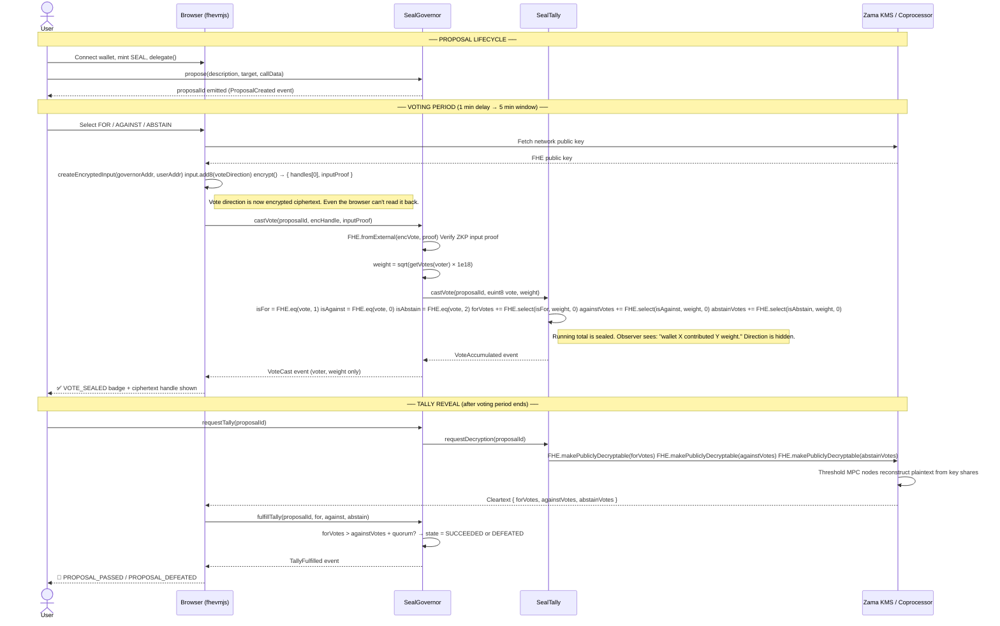

# SealFi — Confidential DAO Governance

> The first confidential DAO governance protocol on Ethereum using Zama's fhEVM. Every vote is sealed until the proposal closes.


---

## Why SealFi Exists

Every DAO governance protocol publishes live vote tallies. `forVotes: 4,821,304`. `againstVotes: 1,203,901`. Updating every block. Visible to every whale, every vote buyer, every coordinated delegate.

This live tally is the attack surface. Whales time their entry for maximum impact. Vote buyers pay for votes and verify delivery by watching the tally update. Delegates signal alignment without committing early.

**SealFi seals the tally.** Your vote is cast as an encrypted `euint8`. It accumulates into an encrypted `euint128` running total using `FHE.select()`. Nobody — not whales, not vote buyers, not the protocol itself — can see the running count until the voting period ends.

```solidity
// OpenZeppelin Governor — full coordination surface exposed
uint256 public forVotes;      // 4,821,304 — whales time their strike here
uint256 public againstVotes;  // 1,203,901 — buyers verify delivery here

// SealFi SealTally — completely sealed during voting
euint128 internal forVotes;      // [SEALED] — invisible until voting closes
euint128 internal againstVotes;  // [SEALED] — invisible until voting closes
euint128 internal abstainVotes;  // [SEALED] — invisible until voting closes
```

Voting also uses **quadratic voting** (`weight = sqrt(balance × 10^18)`) to reduce whale dominance — a holder with 100× more tokens only gets 10× more votes.

---

## Deployed Contracts (Sepolia Testnet)

| Contract | Address | Purpose |
|---|---|---|
| `SealToken` | [`0x61E6012f78b9275F8Af8b7136119eab2d5a2fc37`](https://sepolia.etherscan.io/address/0x61E6012f78b9275F8Af8b7136119eab2d5a2fc37) | ERC20Votes governance token (SEAL) |
| `SealGovernor` | [`0x6FF194327C7CD4F8F24cE5Ec6182838Ebf743991`](https://sepolia.etherscan.io/address/0x6FF194327C7CD4F8F24cE5Ec6182838Ebf743991) | DAO logic — propose, vote, tally, execute |
| `SealTally` | [`0x1Ca7621335Ea1bcff60929bEFaf1d5FDe7c7dFb4`](https://sepolia.etherscan.io/address/0x1Ca7621335Ea1bcff60929bEFaf1d5FDe7c7dFb4) | FHE-encrypted vote accumulator |

---

## Architecture

### System overview

```
┌─────────────────────────────────────────────────────────────────┐
│                        USER BROWSER                             │
│                                                                 │
│   ┌─────────────────┐    ┌──────────────────────────────────┐  │
│   │   Next.js 14    │    │          fhevmjs 0.6              │  │
│   │   (wagmi v2)    │◄──►│  createEncryptedInput()           │  │
│   │                 │    │  input.add8(voteDirection)         │  │
│   │  useVote.ts     │    │  → { handles[0], inputProof }     │  │
│   └────────┬────────┘    └──────────────┬───────────────────┘  │
│            │                            │                       │
└────────────┼────────────────────────────┼───────────────────────┘
             │ wagmi writeContract        │ encrypt via
             │                            │ Zama gateway pubkey
             ▼                            ▼
┌─────────────────────────────────────────────────────────────────┐
│                    ETHEREUM SEPOLIA                             │
│                                                                 │
│  ┌──────────────┐   propose()    ┌──────────────────────────┐  │
│  │  SealToken   │◄───────────────│      SealGovernor        │  │
│  │  ERC20Votes  │   getVotes()   │                          │  │
│  │  (SEAL)      │────────────────►  castVote(encVote, proof) │  │
│  └──────────────┘                │  requestTally()           │  │
│                                  │  fulfillTally()           │  │
│                                  └──────────┬───────────────┘  │
│                                             │ FHE.fromExternal  │
│                                             │ FHE.allowTransient│
│                                             ▼                   │
│                                  ┌──────────────────────────┐  │
│                                  │       SealTally          │  │
│                                  │  euint128 forVotes        │  │
│                                  │  euint128 againstVotes    │  │
│                                  │  euint128 abstainVotes    │  │
│                                  │  FHE.select() multiplexer │  │
│                                  └──────────────────────────┘  │
└─────────────────────────────────────────────────────────────────┘
             │ requestDecryption()
             ▼
┌─────────────────────────────────────────────────────────────────┐
│                ZAMA FHE INFRASTRUCTURE                         │
│                                                                 │
│   ┌──────────────────┐      ┌──────────────────────────────┐  │
│   │   KMS Network    │      │      FHE Coprocessor         │  │
│   │  (Multi-Party    │◄────►│   Performs homomorphic       │  │
│   │   Computation)   │      │   operations off-chain       │  │
│   │                  │      │                              │  │
│   │  Threshold key   │      │  Processes FHE.select()      │  │
│   │  shares — no     │      │  FHE.add() on ciphertexts    │  │
│   │  single point    │      │                              │  │
│   └──────────────────┘      └──────────────────────────────┘  │
└─────────────────────────────────────────────────────────────────┘
```

---

## Voting Flow — Sequence Diagram



---

## FHE Multiplexer — How Privacy Works

The key insight in `SealTally.castVote()` is that **all three branches are evaluated simultaneously** under encryption. The contract never sees which branch was taken:

```solidity
// vote direction is an encrypted uint8 — contract cannot read it
ebool isFor     = FHE.eq(vote, FHE.asEuint8(1));
ebool isAgainst = FHE.eq(vote, FHE.asEuint8(0));
ebool isAbstain = FHE.eq(vote, FHE.asEuint8(2));

euint128 zero = FHE.asEuint128(0);

// FHE.select is a homomorphic ternary: (condition ? a : b) — all computed under encryption
t.forVotes     = FHE.add(t.forVotes,     FHE.select(isFor,     encWeight, zero));
t.againstVotes = FHE.add(t.againstVotes, FHE.select(isAgainst, encWeight, zero));
t.abstainVotes = FHE.add(t.abstainVotes, FHE.select(isAbstain, encWeight, zero));
```

An observer watching the transaction on-chain can see:
- ✅ **WHO** voted — the wallet address
- ✅ **HOW MUCH** weight — quadratic voting power (public token balance)
- ❌ **HOW** they voted — direction stays hidden inside ciphertext

---

## Project Structure

```
PL/
├── contracts/                    # Hardhat project
│   ├── src/
│   │   ├── SealToken.sol         # ERC20Votes governance token (SEAL)
│   │   ├── SealGovernor.sol      # DAO logic: propose → vote → tally → execute
│   │   └── SealTally.sol         # FHE-encrypted vote accumulator
│   ├── scripts/
│   │   ├── deploy.ts             # Deploys all 3 contracts, auto-updates .env
│   │   ├── new-proposal.ts       # Creates a governance proposal on-chain
│   │   └── fulfill-tally.ts      # Finalizes results via script (admin fallback)
│   ├── hardhat.config.ts
│   └── .env                      # DEPLOYER_PRIVATE_KEY + SEPOLIA_RPC_URL
│
└── frontend/                     # Next.js 14 app
    ├── app/
    │   ├── page.tsx              # Landing page
    │   ├── proposals/            # Proposal list with sealed tallies
    │   ├── vote/[id]/            # Individual proposal + voting UI
    │   └── gov/                  # Create proposal form
    ├── hooks/
    │   ├── useToken.ts           # Mint, delegate, balance/votes (auto-polls 8s)
    │   ├── useGovernor.ts        # Read/write proposals (auto-polls 10s)
    │   └── useVote.ts            # fhevmjs encryption + castVote routing
    ├── lib/contracts.ts          # ABI + addresses from .env
    └── .env                      # NEXT_PUBLIC_* contract addresses
```

---

## Setup — Step by Step

### Prerequisites

- **Node.js** v18 or v20 (LTS) — do **not** use v21/v23
- **npm** v9+
- MetaMask wallet with Sepolia ETH — get free ETH from [sepoliafaucet.com](https://sepoliafaucet.com)
- A Sepolia deployer private key (MetaMask → Account Details → Export Private Key)

### 1. Install dependencies

```bash
# Contracts
cd contracts && npm install

# Frontend
cd ../frontend && npm install
```

### 2. Configure contracts/.env

```env
DEPLOYER_PRIVATE_KEY=your_wallet_private_key_here
SEPOLIA_RPC_URL=https://ethereum-sepolia-rpc.publicnode.com
```

### 3. Deploy contracts

```bash
cd contracts
npx hardhat run scripts/deploy.ts --network sepolia
```

The script deploys all three contracts in order, wires them together, mints 10M SEAL to the deployer, and **automatically updates `frontend/.env`** with the new addresses.

### 4. Start the frontend

```bash
cd frontend
npm run dev
```

> After every redeploy, restart `npm run dev` — Next.js reads `.env` at startup.

Open `http://localhost:3000`

---

## Full Test Walkthrough

### Step 1 — Connect wallet
Go to `http://localhost:3000`, click **CONNECT_WALLET**, approve in MetaMask.

### Step 2 — Get tokens
Click **GET_TEST_TOKENS** → calls `SealToken.mint()` → gives 1,000 SEAL to your wallet.

### Step 3 — Activate voting power
Click **ACTIVATE_VOTING** → calls `delegate(yourAddress)` → activates ERC20Votes checkpoint.

### Step 4 — Create proposal (script)

```bash
cd contracts
npx hardhat run scripts/new-proposal.ts --network sepolia
```

### Step 5 — Vote (within ~6 minutes of proposal creation)
1. Go to `/proposals` → click the proposal
2. Wait ~1 minute for voting delay to pass (STATUS changes from PENDING)
3. Select **FOR** / **AGAINST** / **ABSTAIN**
4. Click **CAST_SEALED_VOTE** — you'll see:
   - `SEALING_WITH_FHE...` — fhevmjs encrypts the direction
   - `DEPOSITING...` — transaction submitted to chain
   - `🔒 FHE_ENCRYPTED` badge + truncated ciphertext handle (or `⚠ PLAINTEXT_MODE` if gateway unreachable)

### Step 6 — Tally reveal (~5 minutes after voting opens)
Click **REQUEST_TALLY** → **FULFILL_TALLY** → results appear.

Or use the script fallback:
```bash
PROPOSAL_ID=1 npx hardhat run scripts/fulfill-tally.ts --network sepolia
```

---

## Smart Contract Reference

### SealToken

Standard ERC20 + ERC20Votes + ERC20Permit from OpenZeppelin v5.

| Function | Callable by | Description |
|---|---|---|
| `mint(to, amount)` | Anyone | Testnet faucet — open mint for demo |
| `delegate(delegatee)` | Token holder | Activates voting power checkpoint |
| `getVotes(account)` | Read-only | Current voting power |
| `getPastVotes(account, block)` | Read-only | Voting power at a past block |

### SealGovernor

| Constant | Value | Production value |
|---|---|---|
| `VOTING_DELAY` | 1 minute | 1 day |
| `VOTING_PERIOD` | 5 minutes | 3 days |
| `PROPOSAL_THRESHOLD` | 100 SEAL | Based on tokenomics |
| `QUORUM_BPS` | 0 (disabled) | ~400 (4% of supply) |

| Function | Callable by | Description |
|---|---|---|
| `propose(desc, target, data)` | Holder ≥ 100 SEAL | Creates a proposal |
| `castVote(proposalId, encVote, proof)` | Token holder | **FHE path** — encrypted ballot |
| `castVotePlain(proposalId, direction)` | Token holder | **Testnet only** — plaintext fallback |
| `requestTally(proposalId)` | Anyone after close | Marks tallies for decryption |
| `fulfillTally(id, for, against, abstain)` | Anyone | Writes results, resolves state |

**Proposal states:**
```
PENDING → ACTIVE → TALLYING → SUCCEEDED or DEFEATED → EXECUTED
```

### SealTally

Stores and accumulates encrypted vote totals. Only callable by SealGovernor.

| Function | Description |
|---|---|
| `initTally(proposalId)` | Allocates three encrypted zeros for a new proposal |
| `castVote(proposalId, euint8 vote, weight)` | FHE.select multiplexes weight into correct bucket |
| `requestDecryption(proposalId)` | Marks all handles as publicly decryptable |
| `getTallyHandles(proposalId)` | Returns raw ciphertext handles for off-chain reading |

---

## Quadratic Voting

```
voting_weight = sqrt(token_balance × 10^18)
```

| Token balance | Quadratic weight | vs linear |
|---|---|---|
| 100 SEAL | 10 units | 100× less advantage |
| 1,000 SEAL | ~31.6 units | — |
| 10,000 SEAL | 100 units | — |
| 1,000,000 SEAL | 1,000 units | 1,000× less advantage than linear |

```solidity
// SealGovernor.sol
uint256 weight = Math.sqrt(rawWeight * 1e18); // OpenZeppelin Math.sqrt
```

---

## Compliance and Regulatory Considerations

**Bribery prevention.** Individual vote directions are sealed during voting. A voter cannot prove to a briber how they voted because direction is never individually exposed — only the aggregate tally is revealed at the end. This collapses vote-buying markets mathematically.

**Institutional participation.** Funds and treasuries skip transparent governance because voting signals reveal strategy. FHE-sealed votes let institutions participate without broadcasting positions, improving governance quality and reducing plutocratic gaming.

**Regulatory-friendly.** The aggregate outcome is fully public and auditable on-chain. Regulators can verify tally correctness without accessing individual votes — satisfying transparency requirements while preserving ballot secrecy.

---

## Testnet vs Mainnet

| Feature | Testnet (current) | Mainnet (required) |
|---|---|---|
| Vote path | `castVotePlain` fallback enabled | Only `castVote` (FHE) allowed |
| Voting power | `getVotes()` (current) | `getPastVotes()` (snapshot at proposal creation) |
| Voting delay | 1 minute | 1 day |
| Voting period | 5 minutes | 3 days |
| Quorum | 0 (disabled) | ~4% of total supply |
| Token mint | Open to anyone | Owner-only or fixed supply |
| Tally reveal | Manual button / script | Automated off-chain relayer |

> The `castVotePlain` function has a full `REMOVE BEFORE MAINNET DEPLOYMENT` doc block in the contract with a 5-step migration checklist.

---

## Sponsor Alignment

| Sponsor | Technology Used |
|---|---|
| **Zama** | fhEVM — `euint8`, `euint128`, `ebool`, `FHE.select()`, `FHE.fromExternal()`, `FHE.makePubliclyDecryptable()`, `ZamaEthereumConfig` |
| **Hackathon Track: Cryptography** | Confidential governance using FHE — private voting on a public chain |
| **Hackathon Track: Governance** | Quadratic voting + sealed tally + full DAO lifecycle |

---

## Dependency Summary

### contracts/

| Package | Version | Purpose |
|---|---|---|
| `hardhat` | `^2.22.15` | Build, test, deploy |
| `@nomicfoundation/hardhat-toolbox` | `^5.0.0` | ethers, chai, typechain |
| `@fhevm/solidity` | `0.11.1` | FHE types and operations |
| `@fhevm/hardhat-plugin` | `0.4.2` | Mock coprocessor for local tests |
| `@openzeppelin/contracts` | `^5.3.0` | ERC20Votes, ERC20Permit, Math |

### frontend/

| Package | Version | Purpose |
|---|---|---|
| `next` | `^14.2.0` | React framework |
| `wagmi` | `^2.5.0` | Contract reads/writes |
| `viem` | `^2.9.0` | Ethereum client |
| `fhevmjs` | `^0.6.0` | Client-side FHE encryption |
| `@tanstack/react-query` | `^5.28.0` | Data caching and polling |
| `ethers` | `^6.16.0` | ABI utilities |
| `tailwindcss` | `^3.4.1` | Styling |

---

## Common Issues

| Error | Cause | Fix |
|---|---|---|
| `Transaction likely to fail` | Zero voting power — not delegated | Click **ACTIVATE_VOTING**, wait for confirmation, retry |
| `VotingNotActive` | Voting delay not over, or period closed | Wait for delay or create a new proposal |
| `AlreadyVoted` | Same wallet tried to vote twice | Each wallet votes once per proposal |
| `InsufficientTokens` | `getVotes()` returns 0 | Confirm delegation tx first |
| Proposals not showing | `.env` has old addresses after redeploy | Restart `npm run dev` |
| `No Hardhat config file found` | Running from wrong directory | Run from `contracts/` folder |

---

## Roadmap

- [x] SealToken — ERC20Votes governance token
- [x] SealGovernor — propose, vote, tally, execute lifecycle
- [x] SealTally — FHE-encrypted multiplexed vote accumulator
- [x] Quadratic voting — `sqrt(balance × 10^18)`
- [x] Next.js 14 frontend with brutalist design
- [x] fhevmjs integration — real FHE encryption in browser
- [x] Auto-polling hooks — no hard refreshes needed
- [x] Auto-fulfill tally script
- [x] Full documentation with compliance section
- [ ] Off-chain relayer for automated `fulfillTally()`
- [ ] ConfidentialERC20 for token balance privacy (V2)
- [ ] Multi-proposal concurrent voting support
- [ ] Governance delegation marketplace

---

## License

MIT

---

*SealFi — PL Genesis: Frontiers of Collaboration Hackathon*
