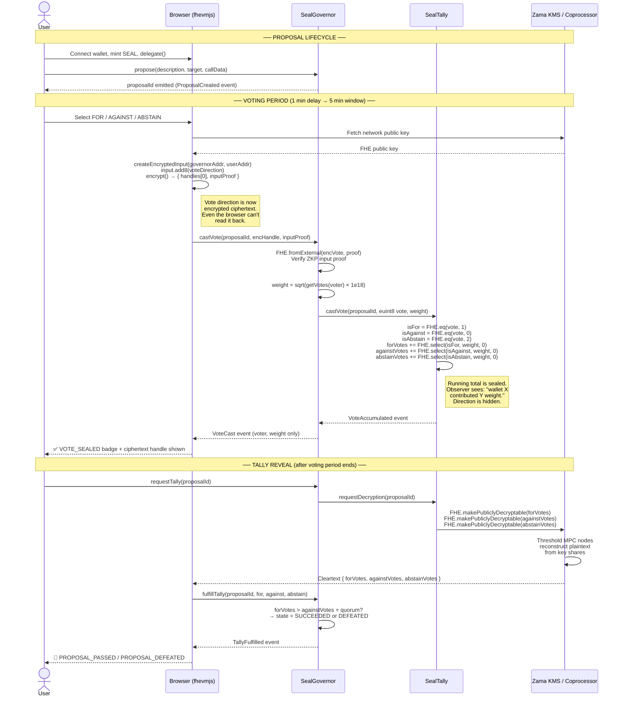

# SealFi — Confidential DAO Governance

SealFi is a governance protocol where token holders vote on proposals and their individual vote direction (FOR / AGAINST / ABSTAIN) stays private via Fully Homomorphic Encryption (FHE). Everyone can see *who* voted and *how much weight* they used, but *nobody* — not even the validators — can see *which way* they voted until the entire voting period ends.

---

## Architecture

### System Overview

```
┌─────────────────────────────────────────────────────────────────┐
│                        USER BROWSER                             │
│                                                                 │
│   ┌─────────────────┐    ┌──────────────────────────────────┐  │
│   │   Next.js 14    │    │          fhevmjs 0.6              │  │
│   │   (wagmi v2)    │◄──►│  createEncryptedInput()           │  │
│   │                 │    │  input.add8(voteDirection)         │  │
│   │  useVote.ts     │    │  → { handles[0], inputProof }     │  │
│   └────────┬────────┘    └──────────────┬───────────────────┘  │
│            │                            │                       │
└────────────┼────────────────────────────┼───────────────────────┘
             │ wagmi writeContract        │ encrypt via
             │                            │ Zama gateway pubkey
             ▼                            ▼
┌─────────────────────────────────────────────────────────────────┐
│                    ETHEREUM SEPOLIA                             │
│                                                                 │
│  ┌──────────────┐   propose()    ┌──────────────────────────┐  │
│  │  SealToken   │◄───────────────│      SealGovernor        │  │
│  │  ERC20Votes  │   getVotes()   │                          │  │
│  │  (SEAL)      │────────────────►  castVote(encVote, proof) │  │
│  └──────────────┘                │  requestTally()           │  │
│                                  │  fulfillTally()           │  │
│                                  └──────────┬───────────────┘  │
│                                             │ FHE.fromExternal  │
│                                             │ FHE.allowTransient│
│                                             ▼                   │
│                                  ┌──────────────────────────┐  │
│                                  │       SealTally          │  │
│                                  │  euint128 forVotes        │  │
│                                  │  euint128 againstVotes    │  │
│                                  │  euint128 abstainVotes    │  │
│                                  │  FHE.select() multiplexer │  │
│                                  └──────────────────────────┘  │
└─────────────────────────────────────────────────────────────────┘
             │ requestDecryption()
             ▼
┌─────────────────────────────────────────────────────────────────┐
│                ZAMA FHE INFRASTRUCTURE                         │
│                                                                 │
│   ┌──────────────────┐      ┌──────────────────────────────┐  │
│   │   KMS Network    │      │      FHE Coprocessor         │  │
│   │  (Multi-Party    │◄────►│   Performs homomorphic       │  │
│   │   Computation)   │      │   operations off-chain       │  │
│   │                  │      │                              │  │
│   │  Threshold key   │      │  Processes FHE.select()      │  │
│   │  shares — no     │      │  FHE.add() on ciphertexts    │  │
│   │  single point    │      │                              │  │
│   └──────────────────┘      └──────────────────────────────┘  │
└─────────────────────────────────────────────────────────────────┘
```

### Full Voting Relay Sequence



---

## How it works (plain English)

1. **A token holder creates a proposal.** (e.g., "Change Treasury Allocation")
2. **Other holders vote.** Each vote is encrypted **client-side** using `fhevmjs` before it hits the blockchain, so the running tally is completely hidden. Even a malicious relay or validator cannot see the vote direction.
3. **After voting closes**, anyone can call `requestTally()` to signal decryption, then `fulfillTally()` to write the clear-text results on-chain once the Zama Gateway processes the MPC decryption.
4. **The contract checks the final counts**, determines if the proposal succeeded, and updates the state.

**Privacy Property:** Every vote is a "Sealed Ballot". People see *who* voted and *how much* weight they used (public), but *which way* they voted (private) remains encrypted until the individual votes are no longer relevant and only the aggregate tally is revealed.

---

## Project Structure

```
PL/
├── contracts/          # Hardhat project — Solidity contracts + deployment scripts
│   ├── src/
│   │   ├── SealToken.sol      # ERC20 governance token with voting checkpoints
│   │   ├── SealGovernor.sol   # DAO logic: propose, vote, tally, execute
│   │   └── SealTally.sol      # FHE encrypted vote accumulator
│   ├── scripts/
│   │   ├── deploy.ts          # Deploys all three contracts, updates frontend .env
│   │   ├── new-proposal.ts    # Creates a governance proposal on-chain
│   │   └── fulfill-tally.ts   # Finalizes results (admin script fallback)
│   ├── hardhat.config.ts
│   └── .env                   # DEPLOYER_PRIVATE_KEY + SEPOLIA_RPC_URL
│
└── frontend/           # Next.js 14 app
    ├── app/
    │   ├── page.tsx           # Landing page
    │   ├── proposals/         # Proposal list
    │   ├── vote/[id]/         # Individual proposal + voting UI
    │   └── gov/               # Create proposal form
    ├── hooks/
    │   ├── useToken.ts        # Mint, delegate, read balance/votes (auto-polls 8s)
    │   ├── useGovernor.ts     # Read proposals (auto-polls 10s), create proposal
    │   └── useVote.ts         # FHE encryption + castVote
    ├── lib/contracts.ts       # ABI + contract addresses pulled from .env
    └── .env                   # NEXT_PUBLIC_* contract addresses
```

---

## Setup Guide

### 1. Prerequisites

- **Node.js** v18 or v20 (LTS).
- **npm** v9+.
- **MetaMask** funded with Sepolia ETH.
- **Sepolia Deployer Key** (Export from MetaMask).

### 2. Contract Setup

```bash
cd contracts
npm install
```

Create `contracts/.env`:
```env
DEPLOYER_PRIVATE_KEY=your_wallet_private_key_here
SEPOLIA_RPC_URL=https://ethereum-sepolia-rpc.publicnode.com
```

### 3. Frontend Setup

```bash
cd frontend
npm install
```

Create `frontend/.env`:
```env
NEXT_PUBLIC_CHAIN_ID=11155111
NEXT_PUBLIC_RPC_URL=https://ethereum-sepolia-rpc.publicnode.com
NEXT_PUBLIC_WC_PROJECT_ID=f715fcc43669af0d4f52376a80d77bff

NEXT_PUBLIC_SEAL_GOVERNOR_ADDRESS=
NEXT_PUBLIC_SEAL_TALLY_ADDRESS=
NEXT_PUBLIC_SEAL_TOKEN_ADDRESS=
```

---

## Deployment Walkthrough

Run the automated deployer from `contracts/`:

```bash
npx hardhat run scripts/deploy.ts --network sepolia
```

**Real output example:**
```
🚀  Deploying SealFi on chain 11155111
    Deployer: 0xcf9d7BCC38996d495BC0a46634B9179748ba6C78
    Balance:  0.190... ETH

1/4  Deploying SealToken...
     ✓ SealToken    @ 0x61E6012f78b9275F8Af8b7136119eab2d5a2fc37
2/4  Deploying SealGovernor...
     ✓ SealGovernor @ 0x6FF194327C7CD4F8F24cE5Ec6182838Ebf743991
3/4  Deploying SealTally...
     ✓ SealTally    @ 0x1Ca7621335Ea1bcff60929bEFaf1d5FDe7c7dFb4
4/4  Wiring SealTally into SealGovernor...
     ✓ setTally() confirmed

     ✓ Minted 10000000.0 SEAL to deployer

📄  Saved deployment addresses to deployment.json
🔗  Updated frontend/.env with contract addresses

✅  Deployment complete!
```

---

## Technical Deep Dive

### 1. Quadratic Voting (Anti-Whale Mechanics)

Votes are not linear. We use the square root of the token balance to calculate voting power:

**Formula:** `effective_weight = sqrt(token_balance × 1e18)`

| Wallet Balance | Voting Weight (units) |
|---|---|
| 100 SEAL | 10.0 |
| 1,000 SEAL | 31.6 |
| 10,000 SEAL | 100.0 |
| 1,000,000 SEAL | 1,000.0 |

**Implementation (`SealGovernor.sol`):**
```solidity
uint256 weight = Math.sqrt(rawWeight * 1e18);
```

### 2. The Sealed Tally Multiplexer

To prevents any information leakage (even the "moving direction" of a tally), we use an encrypted multiplexer. When a user votes, we evaluate all possible outcomes simultaneously under encryption:

**Implementation (`SealTally.sol`):**
```solidity
// vote direction is an encrypted euint8 (0=AGAINST, 1=FOR, 2=ABSTAIN)
ebool isFor     = FHE.eq(vote, FHE.asEuint8(1));
ebool isAgainst = FHE.eq(vote, FHE.asEuint8(0));
ebool isAbstain = FHE.eq(vote, FHE.asEuint8(2));

euint128 zero = FHE.asEuint128(0);

// Add weight only to the branch that matches the encrypted direction
t.forVotes     = FHE.add(t.forVotes,     FHE.select(isFor,     encWeight, zero));
t.againstVotes = FHE.add(t.againstVotes, FHE.select(isAgainst, encWeight, zero));
t.abstainVotes = FHE.add(t.abstainVotes, FHE.select(isAbstain, encWeight, zero));
```

---

## Compliance and Regulatory Considerations

Private voting on a public blockchain is not just a technical feature — it has direct regulatory and defensive relevance:

**Bribery Prevention.** In traditional DAOs, bribers can pay wallets and verify on-chain that they voted a specific way. In SealFi, individual vote directions stay sealed. A voter cannot prove their direction to a briber because it is never exposed in the aggregate tally. This destroys the trust assumption required for vote-buying markets.

**Institutional Participation.** Funds and treasuries often skip governance because voting intentions reveal strategic positions. FHE-encrypted voting lets institutions participate without leaking their strategy early to the market.

---

## Mainnet Migration Checklist

Before going live on mainnet, complete these steps:

- [ ] **Remove `castVotePlain`**: Delete the plaintext fallback function entirely from `SealGovernor.sol`.
- [ ] **Snapshot Logic**: Restore `getPastVotes(msg.sender, prop.snapshotBlock - 1)` inside the FHE path.
- [ ] **Real Timers**: Set `VOTING_DELAY` to 1 day and `VOTING_PERIOD` to 3 days.
- [ ] **Thresholds**: Set `QUORUM_BPS` (e.g., 400 for 4%) and `PROPOSAL_THRESHOLD`.
- [ ] **Relayer**: Deploy an automated relayer to listen for `DecryptionRequested` and call `fulfillTally` automatically.
- [ ] **KMS**: Connect to the Zama mainnet FHE Gateway.

---

## Dependency Summary (v2.0.0)

### contracts/
| Package | Version | Purpose |
|---|---|---|
| `hardhat` | `^2.22.15` | Core Build Framework |
| `@fhevm/solidity` | `0.11.1` | FHE Types and Gates |
| `@openzeppelin/contracts` | `^5.3.0` | Governance Primitives |

### frontend/
| Package | Version | Purpose |
|---|---|---|
| `next` | `^14.2.0` | React Framework |
| `fhevmjs` | `^0.6.0` | Client-side FHE Encryption |
| `wagmi` | `^2.5.0` | Wallet State Management |

---

*SealFi — PL Genesis: Frontiers of Collaboration Hackathon*
